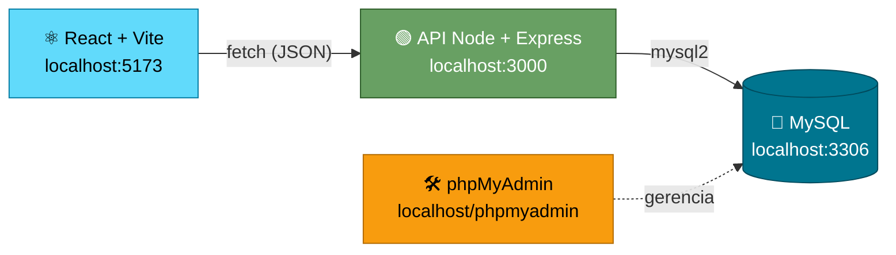

<div align="center">

# 🎓 Portal DSM

### CRUD completo de **Alunos** e **Cursos**

Front-end em React, API em Node.js e banco de dados MySQL.

<br>


</div>

---

## 📑 Índice

- [✨ Funcionalidades](#-funcionalidades)
- [🧰 Tecnologias](#-tecnologias)
- [🧭 Como funciona](#-como-funciona)
- [📁 Estrutura do projeto](#-estrutura-do-projeto)
- [✅ Pré-requisitos](#-pré-requisitos)
- [🚀 Como rodar](#-como-rodar)
- [💾 Banco de dados](#-banco-de-dados)
- [🔌 API](#-api)
- [🧪 Testando com o Postman](#-testando-com-o-postman)
- [🔧 Solução de problemas](#-solução-de-problemas)
- [📝 Observações](#-observações)
- [📜 Scripts do front-end](#-scripts-do-front-end)
- [🔮 Ideias para evoluir o projeto](#-ideias-para-evoluir-o-projeto)

---

## ✨ Funcionalidades

- 👩‍🎓 **Alunos:** listar, cadastrar, editar e excluir. O e-mail é único.
- 📚 **Cursos:** listar, cadastrar, editar e excluir. O nome do curso é único.
- 🛡️ Validação dos dados na API, com mensagens de erro exibidas na tela (por exemplo, "E-mail já cadastrado.").
- 🧭 Navegação entre as páginas **Início**, **Alunos**, **Cursos** e **Sobre**.

## 🧰 Tecnologias

| Camada | Tecnologias |
|--------|-------------|
| ⚛️ Front-end | React 19, Vite, React Router |
| 🟢 Back-end | Node.js, Express 5, mysql2, cors, dotenv |
| 🐬 Banco de dados | MySQL / MariaDB (via XAMPP) |
| 🛠️ Ferramentas | phpMyAdmin, Postman, Git |

## 🧭 Como funciona

O React não fala direto com o banco. Ele chama a API, e a API executa as consultas no MySQL. O phpMyAdmin serve apenas para criar e conferir o banco.



## 📁 Estrutura do projeto

```
AulasMarivaldo/
├── 💾 database/
│   └── portal_dsm.sql          # cria o banco, as tabelas e dados de exemplo
├── ⚛️ portal-dsm/               # front-end (React + Vite)
│   └── src/
│       ├── api/api.js          # funções que chamam a API
│       ├── components/         # Header, Navbar, Footer, Card
│       └── pages/              # Home, Alunos, Cursos, Sobre
└── 🟢 portal-dsm-backend/       # back-end (Node + Express)
    ├── server.js               # inicia o servidor
    ├── .env.example            # modelo das variáveis de ambiente
    └── src/
        ├── config/database.js  # conexão com o MySQL
        ├── routes/             # rotas (usuarioRoutes, cursoRoutes)
        ├── controllers/        # validações e respostas HTTP
        └── models/             # consultas SQL
```

## ✅ Pré-requisitos

- 🟢 [Node.js](https://nodejs.org/) (versão LTS recente)
- 🟠 [XAMPP](https://www.apachefriends.org/) com Apache e MySQL
- 🔀 [Git](https://git-scm.com/)
- 📮 [Postman](https://www.postman.com/) (opcional, para testar a API)

## 🚀 Como rodar

### 1️⃣ Clonar o repositório

```bash
git clone https://github.com/ViniciusBovo/AulasMarivaldo.git
cd AulasMarivaldo
```

### 2️⃣ Ligar o MySQL

Abra o **XAMPP Control Panel** e clique em **Start** nas linhas de **Apache** e **MySQL**.

> [!TIP]
> Os dois módulos devem ficar com o fundo **verde**. Se o MySQL não subir, veja a seção [Solução de problemas](#-solução-de-problemas).

### 3️⃣ Criar o banco de dados

Acesse `http://localhost/phpmyadmin`, abra a aba **SQL**, cole os comandos abaixo e clique em **Executar**.

Se preferir, importe o arquivo `database/portal_dsm.sql` pela aba **Importar**. Ele contém exatamente estes mesmos comandos. O script pode ser executado mais de uma vez sem duplicar os dados.

**🗃️ 3.1 Criar o banco**

```sql
CREATE DATABASE IF NOT EXISTS portal_dsm
  CHARACTER SET utf8mb4
  COLLATE utf8mb4_unicode_ci;

USE portal_dsm;
```

**👩‍🎓 3.2 Criar a tabela de usuários (alunos)**

```sql
CREATE TABLE IF NOT EXISTS usuarios (
  id INT AUTO_INCREMENT PRIMARY KEY,
  nome VARCHAR(100) NOT NULL,
  email VARCHAR(150) NOT NULL UNIQUE,
  criado_em TIMESTAMP DEFAULT CURRENT_TIMESTAMP
);
```

**📚 3.3 Criar a tabela de cursos**

```sql
CREATE TABLE IF NOT EXISTS cursos (
  id INT AUTO_INCREMENT PRIMARY KEY,
  nome VARCHAR(100) NOT NULL UNIQUE,
  descricao VARCHAR(255),
  criado_em TIMESTAMP DEFAULT CURRENT_TIMESTAMP
);
```

**🌱 3.4 Inserir os dados de exemplo**

```sql
INSERT IGNORE INTO usuarios (nome, email)
VALUES
  ('Maria', 'maria@email.com'),
  ('João', 'joao@email.com');

INSERT IGNORE INTO cursos (nome, descricao)
VALUES
  ('Redes de Computadores', 'Protocolos, infraestrutura e comunicação entre sistemas.'),
  ('Inteligência Artificial', 'Aprendizado de máquina e aplicações de IA.'),
  ('Design de Interfaces', 'Usabilidade, prototipação e experiência do usuário.');
```

O `INSERT IGNORE` pula o registro que já existir, porque o e-mail do aluno e o nome do curso são únicos. Assim, rodar o script de novo não gera erro.

> [!NOTE]
> Para conferir, clique no banco `portal_dsm` na coluna da esquerda. As tabelas `usuarios` e `cursos` devem aparecer, cada uma com os registros de exemplo.

### 4️⃣ Configurar o back-end

```bash
cd portal-dsm-backend
npm install
```

Crie o arquivo `.env` a partir do modelo:

```bash
copy .env.example .env      # Windows
cp .env.example .env        # Linux / macOS
```

Confira os valores. O padrão do XAMPP já funciona:

```env
PORTA=3000
DB_HOST=localhost
DB_USER=root
DB_PASSWORD=
DB_NAME=portal_dsm
```

Se você definiu senha para o usuário `root` do MySQL, coloque em `DB_PASSWORD`.

### 5️⃣ Iniciar a API

Ainda na pasta `portal-dsm-backend`:

```bash
node server.js
```

O terminal deve mostrar:

```
Servidor rodando em http://localhost:3000
```

Para conferir, abra `http://localhost:3000/` no navegador. Deve aparecer uma mensagem dizendo que o backend está funcionando.

> [!IMPORTANT]
> **Deixe esse terminal aberto** enquanto usa o site. Fechar o terminal desliga a API.

### 6️⃣ Iniciar o front-end

Em **outro terminal**:

```bash
cd portal-dsm
npm install
npm run dev
```

Abra o endereço que o Vite mostrar, normalmente `http://localhost:5173`, e acesse as páginas **Alunos** e **Cursos**. 🎉

### 🔁 Ordem de inicialização

| Ordem | O que ligar | Como |
|:-----:|-------------|------|
| 1️⃣ | 🐬 MySQL | **Start** no XAMPP |
| 2️⃣ | 🟢 API | `node server.js` |
| 3️⃣ | ⚛️ Front-end | `npm run dev` |

## 💾 Banco de dados

**👩‍🎓 usuarios** (alunos)

| Coluna | Tipo | Regras |
|--------|------|--------|
| 🔑 id | INT | chave primária, auto incremento |
| nome | VARCHAR(100) | obrigatório |
| 📧 email | VARCHAR(150) | obrigatório, único |
| 🕒 criado_em | TIMESTAMP | preenchido automaticamente com a data do cadastro |

**📚 cursos**

| Coluna | Tipo | Regras |
|--------|------|--------|
| 🔑 id | INT | chave primária, auto incremento |
| nome | VARCHAR(100) | obrigatório, único |
| descricao | VARCHAR(255) | opcional |
| 🕒 criado_em | TIMESTAMP | preenchido automaticamente com a data do cadastro |

## 🔌 API

URL base: `http://localhost:3000`

Legenda dos métodos: 🟢 GET (consultar) · 🟡 POST (criar) · 🔵 PUT (editar) · 🔴 DELETE (excluir)

### 👩‍🎓 Alunos

| Método | Rota | Descrição | Corpo (JSON) |
|--------|------|-----------|--------------|
| 🟢 GET | `/usuarios` | Lista todos os alunos | — |
| 🟢 GET | `/usuarios/:id` | Busca um aluno | — |
| 🟡 POST | `/usuarios` | Cadastra um aluno | `{ "nome": "Ana Souza", "email": "ana@exemplo.com" }` |
| 🔵 PUT | `/usuarios/:id` | Atualiza um aluno | `{ "nome": "Ana Souza", "email": "ana@exemplo.com" }` |
| 🔴 DELETE | `/usuarios/:id` | Exclui um aluno | — |

### 📚 Cursos

| Método | Rota | Descrição | Corpo (JSON) |
|--------|------|-----------|--------------|
| 🟢 GET | `/cursos` | Lista todos os cursos | — |
| 🟢 GET | `/cursos/:id` | Busca um curso | — |
| 🟡 POST | `/cursos` | Cadastra um curso | `{ "nome": "Banco de Dados", "descricao": "Modelagem e SQL." }` |
| 🔵 PUT | `/cursos/:id` | Atualiza um curso | `{ "nome": "Banco de Dados", "descricao": "Novo texto." }` |
| 🔴 DELETE | `/cursos/:id` | Exclui um curso | — |

### 🚦 Códigos de resposta

| Código | Quando acontece |
|:------:|-----------------|
| ✅ 200 | Consulta, atualização ou exclusão realizada |
| 🆕 201 | Registro criado |
| ⚠️ 400 | Campo obrigatório ausente (nome, e-mail) |
| 🔍 404 | Registro ou rota não encontrada |
| ⛔ 409 | E-mail ou nome de curso já cadastrado |
| 💥 500 | Erro interno (por exemplo, falha na conexão com o banco) |

As respostas de erro seguem o formato `{ "erro": "mensagem" }`.

## 🧪 Testando com o Postman

1. 🟢 Com a API rodando, crie uma requisição para uma das rotas acima.
2. 📝 Nos métodos **POST** e **PUT**, abra a aba **Body**, escolha **raw** e o formato **JSON**, e cole o corpo de exemplo.
3. 🧨 Teste também os erros: POST sem `nome` (400), e-mail repetido (409) e um `id` que não existe (404).

## 🔧 Solução de problemas

| Problema | Causa provável | O que fazer |
|----------|----------------|-------------|
| 🔴 phpMyAdmin mostra "Nenhuma conexão pôde ser feita" | MySQL desligado | Clique em **Start** no MySQL, no XAMPP. Se não subir, veja se outro MySQL do Windows está usando a porta 3306. |
| 🔌 Tela mostra "Não foi possível conectar à API" | API desligada ou em outra porta | Rode `node server.js` e confira `PORTA=3000` no `.env`. |
| 🧭 "Rota não encontrada." | Servidor antigo rodando ou arquivos de rota ausentes | Pare o servidor (Ctrl+C), confira os arquivos em `src/routes` e rode `node server.js` de novo. |
| 🗃️ "Erro ao listar ..." e o terminal cita `doesn't exist` | Tabela não criada | Execute o SQL do [passo 3](#-como-rodar) ou importe o `database/portal_dsm.sql`. |
| 🔐 Terminal mostra `Access denied` | Usuário ou senha do banco incorretos | Ajuste `DB_USER` e `DB_PASSWORD` no `.env`. |
| ❓ Terminal mostra `Unknown database` | Banco não existe ou nome diferente | Crie o banco e confira o `DB_NAME` no `.env`. |
| 🚫 Terminal mostra `ECONNREFUSED` | MySQL desligado ou `localhost` resolvendo para IPv6 | Ligue o MySQL. Se continuar, troque `DB_HOST` por `127.0.0.1`. |
| 🔒 Terminal mostra `EADDRINUSE` | Porta 3000 já está em uso | Feche o servidor anterior ou use `netstat -ano \| findstr :3000` e `taskkill /PID <número> /F`. |
| ♻️ Alterei o back-end e nada mudou | O Node não recarrega sozinho | Reinicie com Ctrl+C e `node server.js`. |

## 📝 Observações

- 👩‍🎓 Na interface, "Alunos" corresponde à tabela `usuarios` e à rota `/usuarios`.
- 🔗 O endereço da API está definido em `portal-dsm/src/api/api.js` (`API_URL`). Se mudar a porta da API, altere aqui também.

> [!WARNING]
> O arquivo `.env` guarda as credenciais do banco e **não deve ser versionado**. Use o `.env.example` como modelo.

## 📜 Scripts do front-end

| Comando | O que faz |
|---------|-----------|
| `npm run dev` | 🟢 Inicia o servidor de desenvolvimento |
| `npm run build` | 📦 Gera a versão de produção |
| `npm run preview` | 👀 Visualiza a versão de produção localmente |
| `npm run lint` | 🧹 Verifica o código com o ESLint |

## 🔮 Ideias para evoluir o projeto

- [ ] 🔗 Relacionar alunos e cursos (matrículas)
- [ ] 🔍 Busca e filtros nas listagens
- [ ] 🔐 Autenticação de usuários